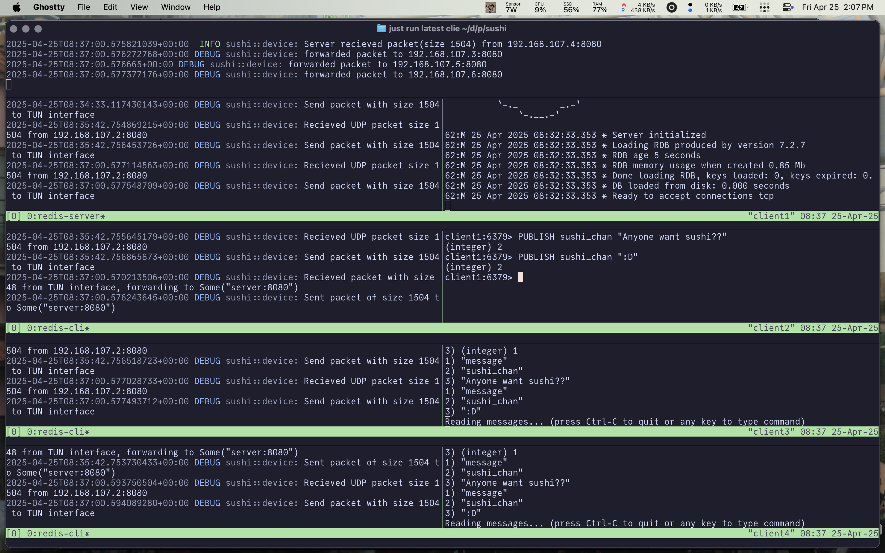

# sushi 🍣

## Setting up the repository

> The image has redis and python installed on alpine installed for testing, you can build the docker image manually or work with the provided justfile

- (optional) create a docker network
```bash
sudo docker network create quaso-test
```

- setting up the image
```bash
# build the docker image
just build latest

# start a container (optional docker network name)
just run latest

############################
### within the container ###
############################

# start a VPN server, inside the container
just vpns server_hostname

# start a VPN client (IP for the tun interface and the server)
just vpnc 10.0.0.2 server_hostname
```


